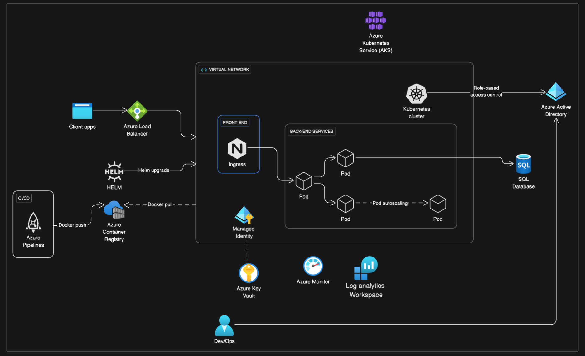

# Production-Ready Azure Kubernetes Platform with Terraform

This repository showcases a real-world, production-grade Azure Kubernetes Service (AKS) platform built entirely with Terraform — reflecting best practices in security, scalability, cost optimization, and modularity.

> Created during a hands-on engagement as a **DevOps Engineer**, While based on live production work, all references have been generalized for confidentiality.

---
## Key Features

- **Modular Infrastructure as Code**: Clean, reusable Terraform modules for resource groups, networking, AKS, ACR, Key Vault, ingress, and more.
- **Secure AKS Cluster**:
  - System-assigned Managed Identity
  - Azure AD-integrated RBAC
  - Workload Identity and OIDC issuer enabled
- **Private Networking**:
  - Azure Firewall, route tables, and NSGs
  - Flat VNet with well-defined subnet structure
- **Scalable Node Pools**:
  - System pool, user pool, and spot pool with autoscaling
  - Cluster Autoscaler configured for efficient resource use
- **Secrets Management**:
  - Azure Key Vault + External Secrets Operator (ESO)
  - Secrets synced securely into Kubernetes
- **TLS and Ingress**:
  - Cert-Manager with Let's Encrypt (ClusterIssuer)
  - NGINX Ingress with HTTPS and Azure DNS automation
- **Monitoring & Observability**:
  - Native integration with **Azure Monitor for Containers**
  - Metrics and logs for AKS, node pools, and workloads
- **Role-Based Access Control (RBAC)**:
  - Azure AD group-based access
  - Granular roles for DevOps, platform, and CI/CD tooling

--- 
## Why This Project?

This project was developed as part of a real-world infrastructure initiative to build a secure, scalable, and modular platform for deploying and managing microservices on Azure Kubernetes Service (AKS). The infrastructure is fully modularized to support reusability, maintainability, and team collaboration, making it easier to onboard developers, integrate CI/CD pipelines, and extend the platform as needs evolve.

This repository serves two purposes:

1. **Technical Portfolio**: A public example of best-practice Kubernetes platform design on Azure.
2. **Reusable Blueprint**: A template for anyone building out a secure AKS-based microservices environment using Terraform.

---
## Current Status

### Core infrastructure complete
- Built a **modular Terraform structure**, organizing components like network, `aks`, `acr`, `keyvault`, `firewall`, `rbac`, and more.
- Created a **flat VNet architecture** with dedicated subnets for AKS, Azure Firewall, and Private Endpoints.
- Azure Firewall deployed inline in the network module with custom route tables for `UserDefinedRouting`.
- System-assigned managed identity enabled for AKS.
- Integrated **Azure Container Registry (ACR)** with `AcrPull` role assigned to AKS managed identity.
- Used Spot node pools for cost efficiency and separate system/user node pools for isolation and resilience.
- Configured **Cluster Autoscaler** on all node pools with appropriate `min_count/max_count` values.
  
### Ingress and TLS active  
- Deployed **NGINX Ingress Controller** via Helm using a dedicated module.
- Configured custom `ingress.yaml` resources to route traffic securely to services.
- Integrated **cert-manager** via Helm with proper CRDs, `ClusterIssuer`, and TLS certificates using Let's Encrypt.
- DNS records automatically managed via **Azure DNS** and external-dns (via Helm) tied to Ingress hostname rules.
- Enabled **production-grade** TLS termination using `kubernetes.io/tls-acme` annotations.

### Secret management and sync working  
- Deployed the **External Secrets Operator (ESO)** via Helm in a dedicated `secrets-sync` module.
- Created `ClusterSecretStore` using Azure Key Vault with workload identity authentication.
- Synced secrets into Kubernetes using `ExternalSecret` resources mapped to specific workloads.
- Secrets exposed securely via environment variables or mounted volumes in pod specs.
- Used **Workload Identity** for ESO access to `Azure Key Vault` instead of client secrets.

### Monitoring & Scaling
- **Azure Monitor** for Containers is enabled by default with AKS cluster provisioning.
- Logs, metrics, and performance insights are collected and visualized via Azure Monitor workbooks and Log Analytics.
- Metrics Server installed via Helm to support **Horizontal Pod Autoscalers (HPA)** for dynamic workload scaling.
- Sample HPA resource created to scale pods based on CPU utilization thresholds.
- Platform is designed to easily integrate Prometheus/Grafana if desired in the future.

### RBAC implemented and documented  
- Modular RBAC setup using a dedicated rbac module supporting both Role and ClusterRole.
- Azure AD group-based RBAC bindings configured for:
- - **DevOps Teams**: Full admin access at the cluster level.
- - **Platform Teams**: Scoped access to specific namespaces.
- - **CI/CD Systems**: Programmatic read/write access for deployments.
- ESO operator, Ingress controller, and HPA controllers granted minimum necessary permissions using Kubernetes-native RBAC.
- `README.md` provided within the RBAC module to help consumers define new bindings with clear examples.

### Continuous improvements ongoing

---
## Acknowledgments
This project draws on years of DevOps engineering experience building cloud-native systems on Azure. It reflects real-world challenges and solutions in running secure, observable, scalable Kubernetes platforms in production.

---
## Contributing
All contributions are welcome and appreciated.
Feel free to fork or use as inspiration for your own Terraform AKS setup.
